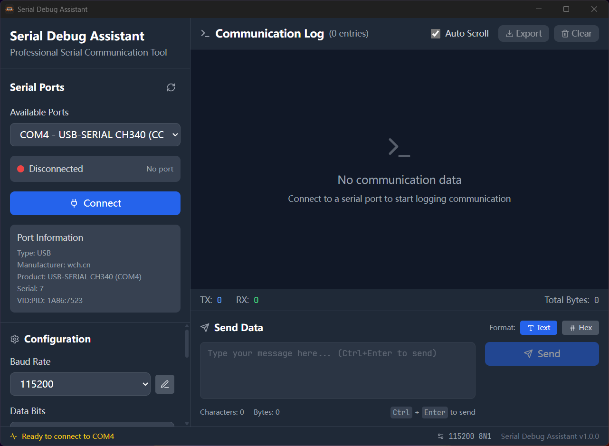
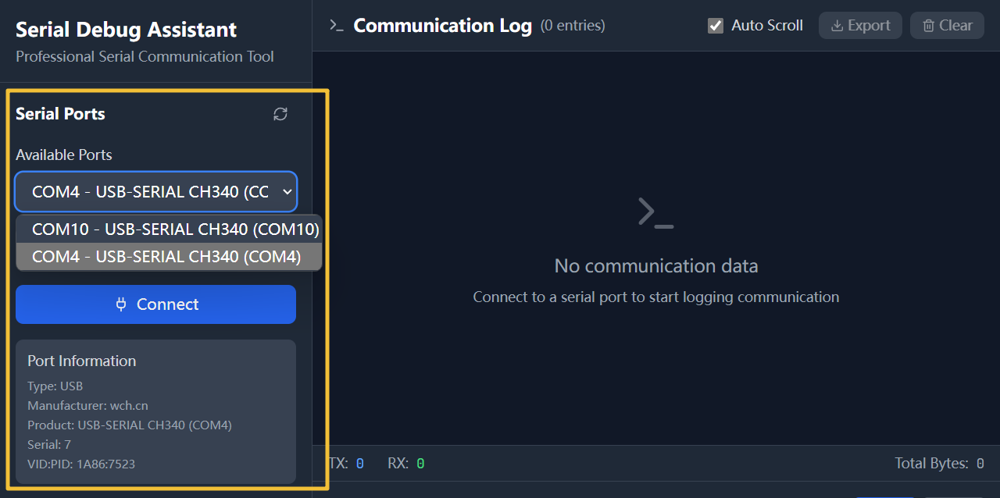
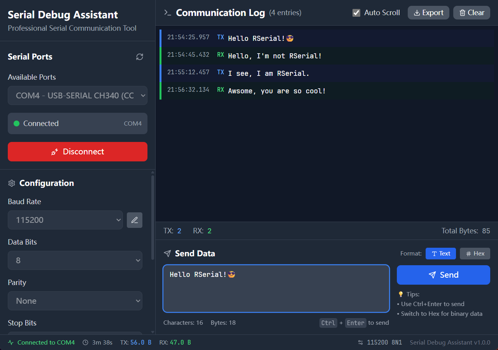
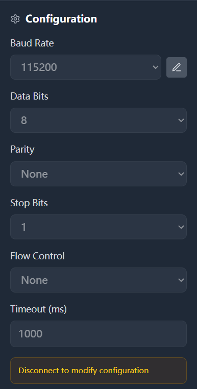

# RSerial Debug Assistant

<div align="center">


**A modern, cross-platform serial debugging tool built with Tauri + React**

[](LICENSE)
[](https://www.rust-lang.org/)
[](https://tauri.app/)
[](https://reactjs.org/)

[Features](#-features) | [Installation](#-installation) | [Quick Start](#-quick-start) | [Screenshots](#-screenshots) | [Contributing](#-contributing)

</div>

---

## About

RSerial Debug Assistant is a professional-grade serial communication tool that combines the power of **Rust** with the beauty of modern **React** UI. Whether you're debugging embedded systems, testing Arduino projects, or working with any serial device, this tool provides a seamless experience across Windows, macOS, and Linux.

## Features

### User Interface
- **Light/Dark Theme** - Automatic and manual theme switching with macOS-style design
- **Responsive Layout** - Resizable panels that adapt to your workflow
- **Real-time Logging** - Live communication display with timestamps and direction indicators
- **Intuitive Controls** - Professional UI inspired by modern development tools

### Serial Communication
- **Smart Port Detection** - Automatic detection of available serial ports
- **Full Configuration** - Baud rate, data bits, parity, stop bits, flow control
- **Dual Data Formats** - Send and receive as Text or Hexadecimal
- **Connection Statistics** - Track bytes sent/received and connection time

### Advanced Features
- **Quick Commands** - Save and execute frequently used commands with one click
- **Checksum Append** - Automatically append checksum (CRC, LRC, etc.) to outgoing data
- **Settings Panel** - Customize application behavior and appearance
- **Scheduled Sending** - Send data at configurable intervals
- **Data Export** - Save communication logs in TXT format
- **Keyboard Shortcuts** - Ctrl+Enter to send, and more productivity shortcuts

## Installation

### Download Pre-built Binaries

Download the latest release for your platform from the [Releases](https://github.com/Gyanano/RSerialDebugAssistant/releases) page.

| Platform | Download |
|----------|----------|
| Windows  | `.msi` or `.exe` installer |
| macOS    | `.dmg` disk image |
| Linux    | `.deb` or `.AppImage` |

### Build from Source

#### Prerequisites

- **Rust** 1.70+ - Install from [rustup.rs](https://rustup.rs/)
- **Node.js** 18+ - Install from [nodejs.org](https://nodejs.org/)
- **Git** - For cloning the repository

#### Steps

```bash
# Clone the repository
git clone https://github.com/Gyanano/RSerialDebugAssistant.git
cd RSerialDebugAssistant

# Install frontend dependencies
cd frontend
npm install
cd ..

# Build the application
cargo tauri build
```

The built application will be in `src-tauri/target/release/bundle/`

## Quick Start

### Development Mode

```bash
# Terminal 1: Start frontend dev server
cd frontend
npm run dev

# Terminal 2: Start Tauri dev mode (from project root)
cargo tauri dev
```

### Basic Usage

1. **Select Port** - Choose from available serial ports in the dropdown
2. **Configure** - Set baud rate, data bits, parity, stop bits
3. **Connect** - Click the connect button to establish communication
4. **Send Data** - Enter text or hex data and click send (or press Ctrl+Enter)
5. **Monitor** - Watch real-time communication in the log viewer
6. **Export** - Save your communication logs for later analysis

### Interface Layout

```
┌─────────────────────────────────────────────────────────────┐
│ RSerial Debug Assistant                         [Settings]  │
├───────────────┬─────────────────────────────────────────────┤
│ Port Selector │                                             │
│               │         Log Viewer                          │
│ Configuration │     (Real-time Communication)               │
│   Panel       │                                             │
│               ├─────────────────────────────────────────────┤
│ Quick         │                                             │
│ Commands      │         Send Panel                          │
│               │     [Text/Hex Input] [Checksum Options]     │
├───────────────┴─────────────────────────────────────────────┤
│                    Status Bar                               │
└─────────────────────────────────────────────────────────────┘
```

## Screenshots

### Main Interface


### Port Selection


### Real-time Communication


### Configuration Panel


## Tech Stack

| Component | Technology |
|-----------|------------|
| Backend | Rust + Tauri 2.0 |
| Frontend | React 18 + TypeScript |
| Styling | Tailwind CSS |
| Serial I/O | serialport-rs |
| Build Tool | Vite |
| Icons | Lucide React |

## Project Structure

```
RSerialDebugAssistant/
├── src-tauri/                 # Rust backend
│   ├── src/
│   │   ├── main.rs            # Tauri app entry point
│   │   ├── serial_manager.rs  # Serial communication logic
│   │   └── types.rs           # Shared type definitions
│   ├── Cargo.toml             # Rust dependencies
│   └── tauri.conf.json        # Tauri configuration
│
├── frontend/                  # React frontend
│   ├── src/
│   │   ├── components/        # React components
│   │   ├── App.tsx            # Main app component
│   │   └── types.ts           # TypeScript types
│   ├── package.json           # Node.js dependencies
│   └── vite.config.ts         # Vite configuration
│
├── assets/                    # Screenshots and images
├── README.md
└── LICENSE
```

## Contributing

Contributions are welcome! Here's how you can help:

1. **Fork** the repository
2. **Create** a feature branch (`git checkout -b feature/amazing-feature`)
3. **Commit** your changes (`git commit -m 'Add amazing feature'`)
4. **Push** to the branch (`git push origin feature/amazing-feature`)
5. **Open** a Pull Request

### Development Guidelines

- Follow Rust and TypeScript best practices
- Write clear commit messages
- Update documentation as needed
- Test on multiple platforms if possible

### Reporting Issues

Found a bug or have a feature request? Please [open an issue](https://github.com/Gyanano/RSerialDebugAssistant/issues) with:
- Clear description of the problem or feature
- Steps to reproduce (for bugs)
- Your platform and version information

## License

This project is licensed under the MIT License - see the [LICENSE](LICENSE) file for details.

## Acknowledgments

- [Tauri](https://tauri.app/) - Framework for building desktop apps
- [React](https://reactjs.org/) - UI library
- [Rust](https://www.rust-lang.org/) - Systems programming language
- [serialport-rs](https://gitlab.com/susurrus/serialport-rs) - Rust serial port library
- [Tailwind CSS](https://tailwindcss.com/) - Utility-first CSS framework
- [Lucide React](https://lucide.dev/) - Icon library

---

<div align="center">

## Star History

[](https://star-history.com/#Gyanano/RSerialDebugAssistant&Date)

---

**If you find this project helpful, please consider giving it a star!**

Made with Rust and React

</div>
